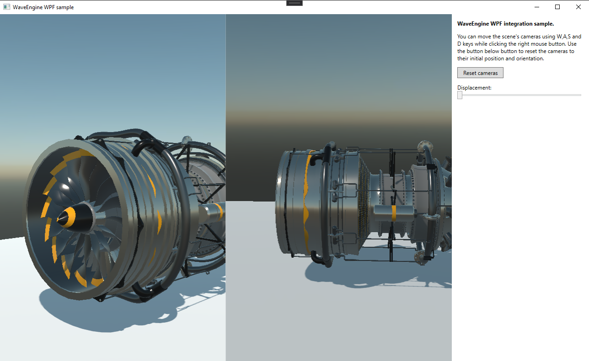

# UI API integrations Demo

This demo shows how you can integrate WaveEngine in an application using the WindowSystem. The Windows Forms and SDL uses the full window to render the application and the WPF sample demonstrates a way to include a WaveEngine renderer and how it can interact with WPF controls.

We are still working to improve the existing WindowSystems (like modifying the SDL sample to run in Linux and Mac) and to add more supported platforms (like WinUI).

Video: https://www.youtube.com/watch?v=MOgKXaxselg

## Build and Test

Required Visual Studio 16.8 with .NET5 support.

You can also test the binaries in the [Releases](https://github.com/WaveEngine/UIWindowSystemsDemo/releases) section.

----
Powered by **[WaveEngine 3.2](http://www.waveengine.net)**

LET'S CONNECT!

- [Youtube](https://www.youtube.com/subscription_center?add_user=WaveEngineChannel)
- [Twitter](https://twitter.com/WaveEngineTeam)
- [Blog](http://geeks.ms/waveengineteam/)
