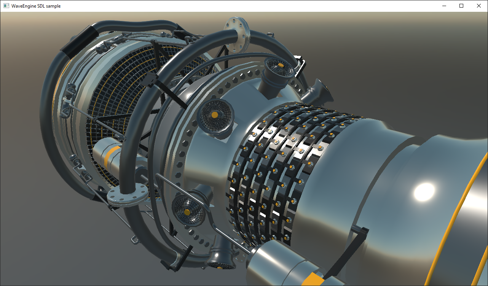

# UI API integrations Demo

This demo shows how you can integrate Evergine in an application using the WindowSystem. The Windows Forms, SDL and UWP samples use the full window to render the application, the WPF and WinUI samples demonstrate a way to include a Evergine renderer and how it can interact with WPF controls.

We are still working to improve the existing WindowSystems (like modifying the SDL sample to run in Linux and Mac).

Video: https://www.youtube.com/watch?v=MOgKXaxselg

## Build and Test

Required Visual Studio 2022 with .NET6 support.

You can also test the binaries in the [Releases](https://github.com/Evergine/UIWindowSystemsDemo/releases) section.

----
Powered by **[Evergine](http://www.evergine.com)**

LET'S CONNECT!

- [Youtube](https://www.youtube.com/subscription_center?add_user=WaveEngineChannel)
- [Twitter](https://twitter.com/WaveEngineTeam)
- [Blog](http://geeks.ms/waveengineteam/)
