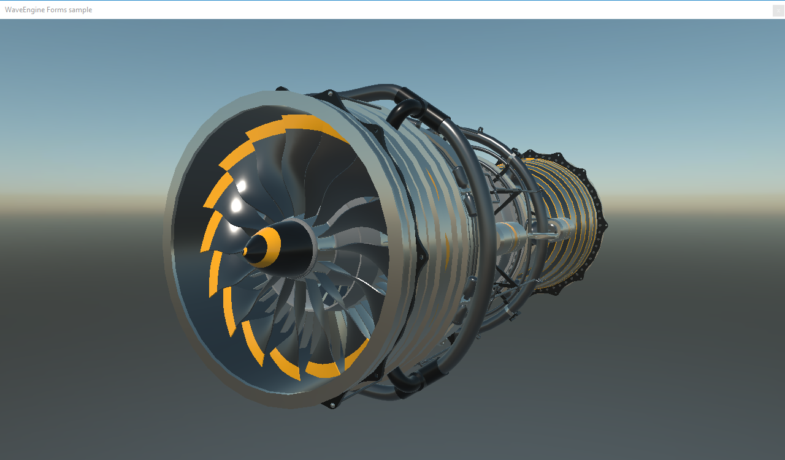

# UI API integrations Demo

This demo shows how you can integrate Evergine in an application using the WindowSystem. The Windows Forms, SDL and UWP samples use the full window to render the application, the WPF and WinUI samples demonstrate a way to include a Evergine renderer and how it can interact with WPF controls.

We are still working to improve the existing WindowSystems (like modifying the SDL sample to run in Linux and Mac).

Video: https://www.youtube.com/watch?v=MOgKXaxselg

## Extended samples
Some of windows system samples provide additional features.
- **WPF**: You have the option in _App.xaml_ file to choose between creating a single window with two rendering surfaces, or create two windows, and each one of them with an independent rendering surface.
- **WinForms**: Changing value of _ShowSingleWindowSample_ you can test a rendering surface for the full window, or have a rendering surface that can be with other native UI elements.

## Build and Test

Required Visual Studio 2022 with .NET6 support.

You can also test the binaries in the [Releases](https://github.com/Evergine/UIWindowSystemsDemo/releases) section.

----
Powered by **[Evergine](http://www.evergine.com)**

LET'S CONNECT!

- [Youtube](https://www.youtube.com/channel/UCpA-X92rxM0OuywdVcir9mA)
- [Twitter](https://twitter.com/EvergineTeam)
- [News](https://evergine.com/news/)
